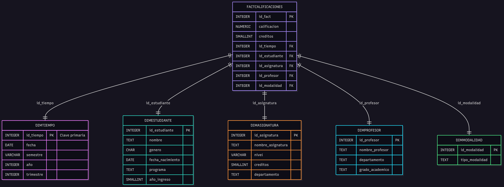
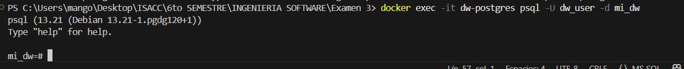
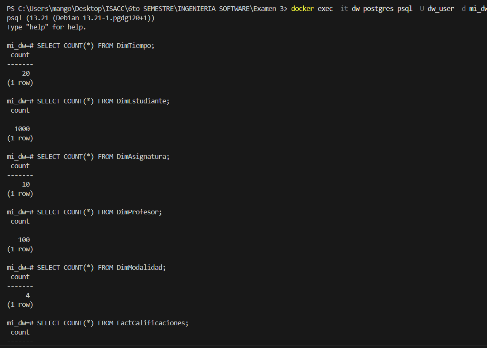
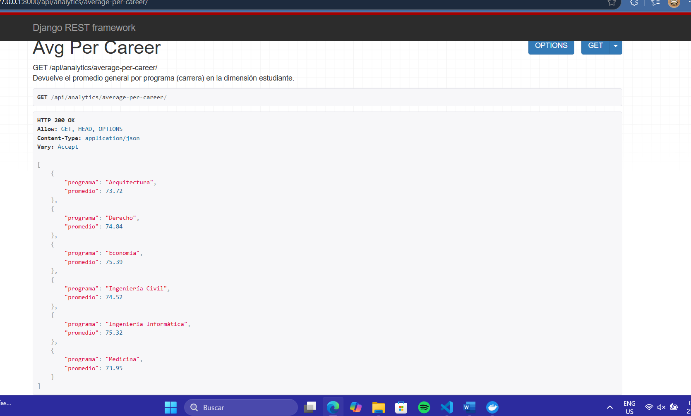
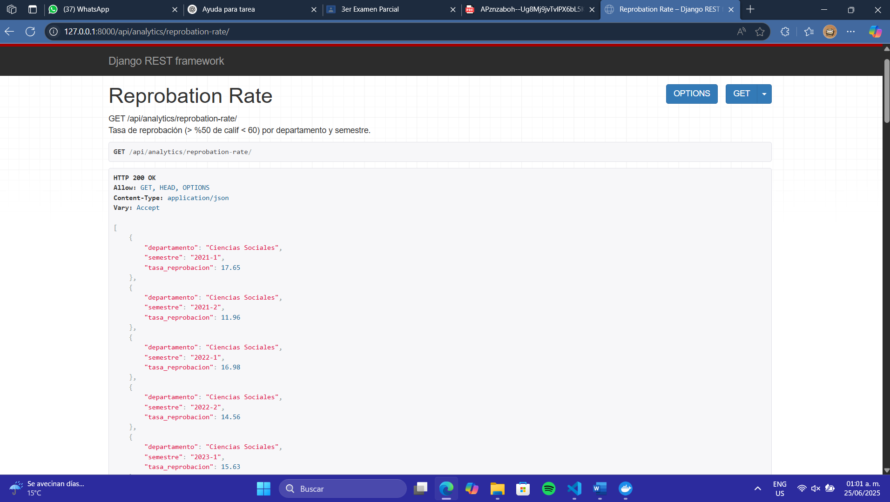
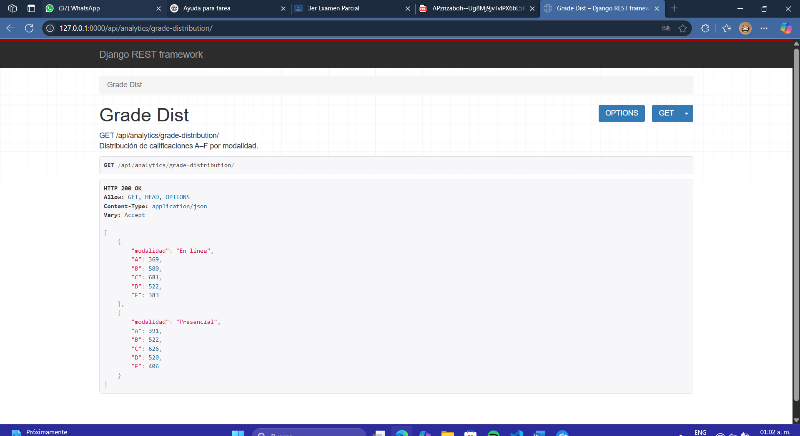
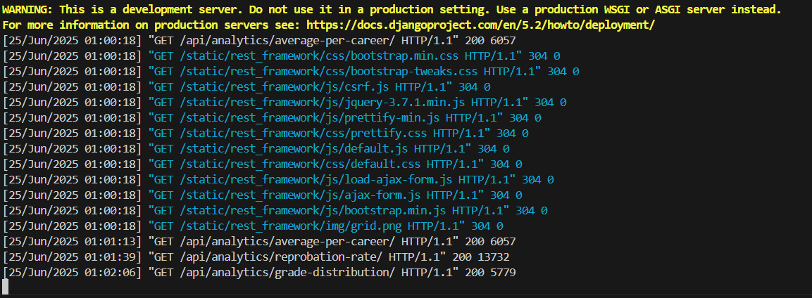
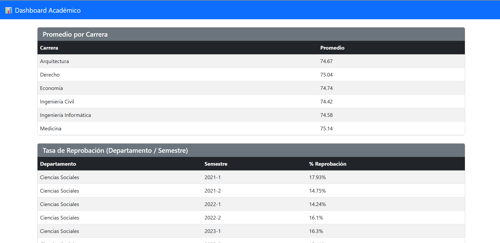
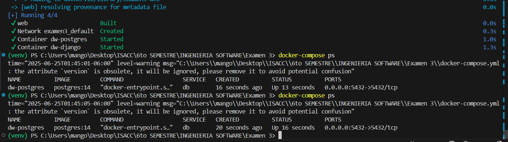

# Data Warehouse Académico

Este repositorio contiene un Data Warehouse para análisis de rendimiento académico y una API REST en Django para exponer métricas clave.

## 📄 Documento de Propuesta (Fase 1)

En el archivo `Documentacion examen.pdf` encontrarás el documento de propuesta que cubre:

1. **Dominio y Problema**  
   - Análisis de rendimiento académico  
   - Justificación para usar un Data Warehouse  

2. **Preguntas de Negocio**  
   1. Evolución del promedio por carrera en los últimos 8 semestres  
   2. Asignaturas con mayor tasa de reprobación por departamento y semestre  
   3. Distribución de calificaciones (A–F) por modalidad (presencial vs. en línea)  

3. **Esquema Conceptual en Estrella**  
   - Diagrama ER con una tabla de hechos (`FactCalificaciones`) y 5 dimensiones (`DimTiempo`, `DimEstudiante`, `DimAsignatura`, `DimProfesor`, `DimModalidad`)  


## 📚 Fases del proyecto

1. **Fase 1 – Propuesta**  
   - Caso de uso: análisis de rendimiento académico.  
   - Preguntas de negocio y esquema en estrella.  
   
2. **Fase 2 – Diseño e Implementación**  
   - DDL en PostgreSQL (`schema.sql`).  
   - Script de datos sintéticos (`poblar_dw.py`).  
   
   
3. **Fase 3 – API Backend**  
   - Django + Django REST Framework.  
   - Endpoints para consultas analíticas y carga/actualización de datos.
        curl http://127.0.0.1:8000/api/analytics/average-per-career/
        curl http://127.0.0.1:8000/api/analytics/grade-distribution/
        curl http://127.0.0.1:8000/api/analytics/reprobation-rate/
    
   
   
   
   
4. **Fase 4 – Orquestación**  
   - Docker Compose para PostgreSQL 14 + Django.
   

## ⚙️ Requisitos

- Python 3.10+  
- Docker & Docker Compose (opcional, pero recomendado)  
- (Si ejecutas local) PostgreSQL 14+  

## 🚀 Ejecutar localmente (sin Docker)

1. Clona el repo:
   ```bash
   git clone https://github.com/isaking0233/Examen-3
   cd Examen 3
   docker-compose up --build -d

